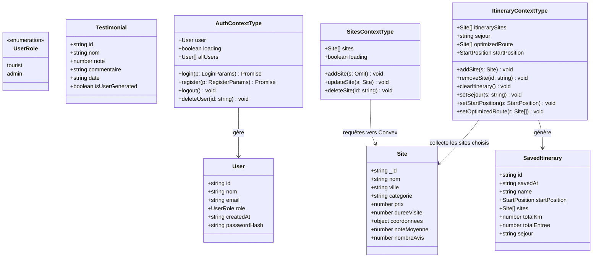
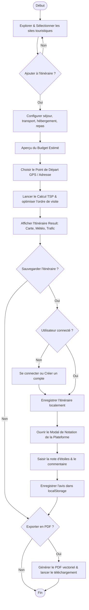
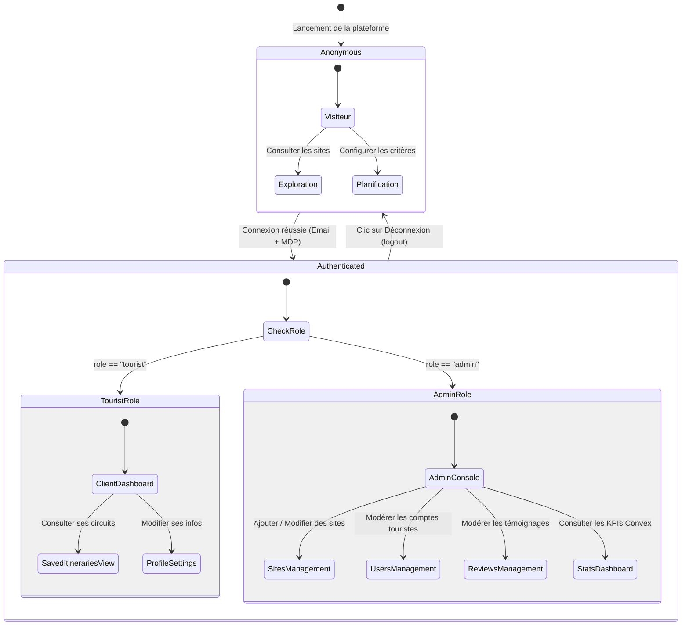
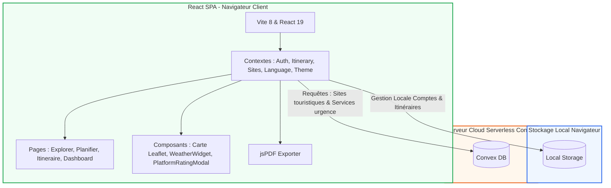
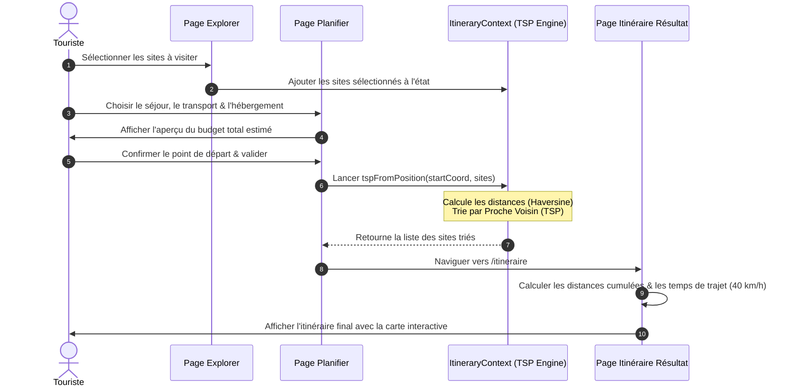
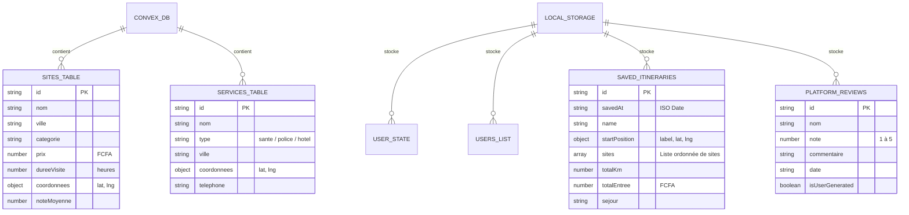

# Guide des Diagrammes & Algorithmes de Calcul — SmartTour Bénin

Ce document fournit les spécifications complètes et les modèles pour concevoir les diagrammes de votre projet, ainsi que les explications détaillées concernant le calcul de la distance totale et du budget estimé.

---

## 📊 1. Modèles de Diagrammes à Réaliser

Voici les diagrammes clés pour documenter l'architecture, la structure orientée objet, les comportements d'état et les flux d'activités de SmartTour Bénin. Les codes source Mermaid sont inclus pour vous permettre de les générer ou les visualiser directement.

### A. Diagramme de Classes (UML Class Diagram)
Ce diagramme détaille la structure des données du projet, les Contextes React (providers), les types de données fondamentaux et les relations d'association.



### B. Diagramme d'Activité (UML Activity Diagram)
Ce diagramme montre le processus d'interaction typique d'un voyageur de l'exploration de sites jusqu'à la notation de la plateforme et l'exportation en PDF.



### C. Diagramme d'États-Transitions (State Machine Diagram)
Illustre le cycle de vie de la session de l'utilisateur sur la plateforme et les transitions de sécurité d'un rôle à l'autre.



### D. Diagramme d'Architecture Système
Ce diagramme montre les interactions entre le navigateur de l'utilisateur (le frontend React), le stockage local (`localStorage`) et le backend serverless (Convex).



### E. Diagramme de Cas d'Utilisation (Use Cases)
Ce diagramme détaille les actions possibles selon le rôle de l'utilisateur (Touriste vs. Administrateur).

```mermaid
left-to-right direction
actor Touriste
actor Administrateur

rectangle SmartTour {
  Touriste --> (Explorer les sites)
  Touriste --> (Planifier un circuit)
  Touriste --> (Sauvegarder l'itinéraire)
  Touriste --> (Exporter en PDF / Partager)
  Touriste --> (Noter la plateforme & donner un avis)

  (Sauvegarder l'itinéraire) .> (Se connecter / S'inscrire) : <<include>>
  (Noter la plateforme & donner un avis) .> (Se connecter / S'inscrire) : <<include>>

  Administrateur --> (Gérer les sites touristiques)
  Administrateur --> (Gérer les comptes utilisateurs)
  Administrateur --> (Gérer les avis / commentaires)
  Administrateur --> (Consulter les statistiques globales)
}
```

### F. Diagramme de Séquence : Planification & TSP
Ce diagramme illustre le flux d'informations lors du tri de l'itinéraire par l'algorithme du plus proche voisin (TSP).



### G. Diagramme de Modèle de Données (Modèle Physique de Données)
Décrit la structure des tables hébergées sur Convex et des objets enregistrés dans le stockage local du navigateur.



---

## 📏 2. Algorithme de Calcul de la Distance Totale

La distance totale de l'itinéraire est calculée en additionnant les distances individuelles entre chaque étape dans l'ordre trié.

### A. La Formule de Haversine
Pour obtenir des distances réalistes à la surface de la terre, le projet n'utilise pas la simple distance géométrique 2D (Euclidienne), mais la **formule de Haversine** qui prend en compte la courbure sphérique terrestre :

$$d = 2R \cdot \operatorname{atan2}\left(\sqrt{h}, \sqrt{1-h}\right)$$

Où $R$ est le rayon de la Terre ($6371\text{ km}$) et $h$ est calculé par :

$$h = \sin^2\left(\frac{\Delta \varphi}{2}\right) + \cos(\varphi_1)\cdot\cos(\varphi_2)\cdot\sin^2\left(\frac{\Delta \lambda}{2}\right)$$

*   $\varphi_1, \varphi_2$ : Latitudes des deux points en radians.
*   $\Delta \varphi$ : Différence de latitude en radians.
*   $\Delta \lambda$ : Différence de longitude en radians.

### B. Code d'Implémentation Javascript/Typescript
Ce calcul est implémenté dans le fichier [PlanifierPage.tsx](file:///c:/Users/brayan/Desktop/SmartTour/frontend/src/pages/PlanifierPage.tsx#L40-L44) et [ItineraryResultPage.tsx](file:///c:/Users/brayan/Desktop/SmartTour/frontend/src/pages/ItineraryResultPage.tsx#L18-L22) :

```typescript
function haversineKm(a: { lat: number; lng: number }, b: { lat: number; lng: number }) {
  const R = 6371; // Rayon de la Terre en kilomètres
  const dLat = ((b.lat - a.lat) * Math.PI) / 180;
  const dLng = ((b.lng - a.lng) * Math.PI) / 180;
  
  const h = 
    Math.sin(dLat / 2) ** 2 + 
    Math.cos((a.lat * Math.PI) / 180) * 
    Math.cos((b.lat * Math.PI) / 180) * 
    Math.sin(dLng / 2) ** 2;
    
  return R * 2 * Math.atan2(Math.sqrt(h), Math.sqrt(1 - h));
}
```

### C. Le Calcul de la Distance Totale Cumulée
Une fois que l'itinéraire est trié de l'étape $0$ à l'étape $N$ :
1.  **Point de départ personnalisé** : Si l'utilisateur a défini une adresse de départ, la distance initiale est calculée entre cette adresse et la première étape.
2.  **Distance Inter-étapes** : On boucle sur la liste des sites ordonnés et on additionne la distance entre l'étape $i-1$ et l'étape $i$.
3.  **Somme finale** :
    ```typescript
    const totalKm = steps.reduce((sum, step) => sum + step.kmFromPrev, 0);
    ```

---

## 💰 3. Algorithme de Calcul du Budget Estimé

Le calcul du budget se divise en deux contextes distincts dans l'application : l'**aperçu estimé** lors de la configuration et le **coût réel des entrées** sur l'itinéraire final.

### Context 1 : L'Aperçu du Budget Total Estimé (Page Planifier)
Sur la page [PlanifierPage.tsx](file:///c:/Users/brayan/Desktop/SmartTour/frontend/src/pages/PlanifierPage.tsx#L87-L101), le budget prend en compte l'ensemble des dépenses prévisionnelles (entrées, transport, hébergement, nourriture) selon les paramètres choisis par l'utilisateur.

La formule de calcul du budget total est la suivante :

$$\text{Budget Estimé} = \text{Total Entrées} + \text{Coût Transport} + \text{Coût Hébergement} + \text{Coût Restauration}$$

#### 1. Coût des Entrées (Monuments)
C'est la somme des tarifs de ticket de chaque site sélectionné :
$$\text{Total Entrées} = \sum (\text{prix du site})$$

#### 2. Coût du Transport
Il est basé sur la distance totale du trajet (somme des distances entre les sites sélectionnés) multipliée par le tarif kilométrique du moyen de transport choisi :
$$\text{Coût Transport} = \text{Distance Totale (km)} \times \text{Tarif km}$$

Les tarifs par kilomètre définis dans le projet sont :
*   **Voiture** : $120\text{ FCFA/km}$
*   **Taxi** : $180\text{ FCFA/km}$
*   **Taxi-moto (Zémidjan)** : $80\text{ FCFA/km}$
*   **Bus** : $50\text{ FCFA/km}$

#### 3. Coût de l'Hébergement
Il est calculé pour le nombre de nuits du séjour (nombre de jours - 1). Si le séjour est de 1 jour, le coût de l'hébergement est de 0.
$$\text{Coût Hébergement} = \text{Tarif Nuit} \times \max(0, \text{Nombre de jours} - 1)$$

Les tarifs par nuit définis sont :
*   **Aucun** : $0\text{ FCFA/nuit}$
*   **Camping** : $3\ 000\text{ FCFA/nuit}$
*   **Auberge** : $8\ 000\text{ FCFA/nuit}$
*   **Hôtel** : $20\ 000\text{ FCFA/nuit}$
*   **Resort** : $45\ 000\text{ FCFA/nuit}$

#### 4. Coût de la Restauration
C'est le budget alloué par jour multiplié par la durée totale du séjour :
$$\text{Coût Restauration} = \text{Budget quotidien choisi} \times \text{Nombre de jours}$$

---

### Context 2 : Le Budget des Entrées (Page Résultat / PDF / Sauvegardes)
Sur la page [ItineraryResultPage.tsx](file:///c:/Users/brayan/Desktop/SmartTour/frontend/src/pages/ItineraryResultPage.tsx#L77), le tableau de bord et dans l'export PDF final, pour des raisons de précision, le budget reporté correspond au **coût total des tickets d'entrée des musées et parcs** (dépenses incompressibles sur place) :

$$\text{Budget Entrées} = \sum_{i=1}^{N} \text{prix du site}_i$$

*   Si le site est gratuit (ex: Plage de Grand-Popo, Place de l'Amazone), la valeur ajoutée est $0$.
*   L'affichage formate les milliers pour une lecture aisée (ex: `25 000 FCFA` au lieu de `25000`).
