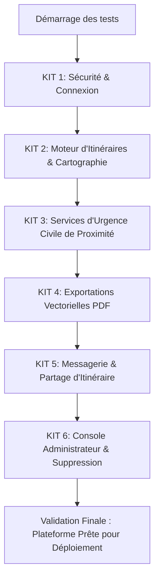

# 🗺️ SMARTTOUR BÉNIN : MANUEL DE RÉFÉRENCE COMPLET & PROTOCOLE DE TEST CRITIQUE DE PRODUCTION

Ce document officiel constitue la bible technique, fonctionnelle et opérationnelle de la plateforme **SmartTour Bénin**. Il est rédigé de manière exhaustive, **ligne par ligne, trait par trait, fonctionnalité par fonctionnalité**, afin de consigner la totalité du périmètre applicatif, son architecture, ses forces technologiques intrinsèques et un **protocole de test rigoureux de grade critique (type "système hospitalier")** pour éprouver le système en conditions réelles.

---

## 🏛️ SECTION A : PRÉSENTATION DE LA DEMO & DE LA VISION DU PROJET

### 1. Qu'est-ce que SmartTour Bénin ?
**SmartTour Bénin** est une application Web Single Page (SPA) de planification d'itinéraires et d'exploration touristique intelligente en République du Bénin. Conçue avec des exigences d'ergonomie et de performance haut de gamme, elle résout le problème complexe du voyageur de commerce pour les touristes tout en leur offrant des services contextuels essentiels (météo, trafic, sécurité civile).

### 2. La Pile Technologique (The Stack)
La plateforme utilise une architecture découplée de pointe, combinant réactivité et robustesse :
*   **Interface Utilisateur (Frontend)** : **React 19** avec **TypeScript** et **Vite 8** pour des cycles de build ultra-rapides et un typage statique strict (0 erreur de compilation).
*   **Moteur de Styles** : **TailwindCSS 4** pour une charte graphique premium fluide (mélange de couleurs émeraude, vert forêt et accents dorés), responsive et adaptative (mobile first).
*   **Base de Données & Backend** : **Convex Serverless** offrant une synchronisation en temps réel (Reactive State Engine) à très faible latence (websockets natifs), sans serveur traditionnel à gérer.
*   **Cartographie Interactive** : **Leaflet** associé aux cartes libres d'**OpenStreetMap** pour un rendu géographique fluide sans redevances API tierces.
*   **Moteur d'Export PDF** : **jsPDF** pour la génération vectorielle de documents imprimables de haute qualité directement depuis le navigateur du client.
*   **Messagerie et Alertes** : **React Hot Toast** pour les retours utilisateur et protocole **mailto:** natif assurant un lien direct avec les logiciels de messagerie de l'appareil.

### 3. Les Puissances & Forces de l'Application
*   **Synchronisation Réactive Convex** : Toutes les données (itinéraires sauvegardés, modifications de comptes) sont partagées en temps réel sur tous les appareils de l'utilisateur grâce à l'abonnement automatique aux requêtes Convex.
*   **Sécurité Industrielle Serverless** : Les calculs sensibles (chiffrement de mots de passe, requêtes SQL/NoSQL) s'exécutent de manière isolée dans le cloud de Convex.
*   **Algorithme TSP (Traveling Salesperson Problem)** : Résolution en millisecondes de l'ordre de visite optimal en utilisant les vraies coordonnées géographiques par calcul de distance de **Haversine**.
*   **Tolérance aux Pannes & Mode Dégradé** : Si une API échoue (ex: météo ou trafic), le système affiche des fallbacks intelligents (données prédictives ou recommandations statiques) pour garantir une expérience utilisateur fluide sans écran blanc.

---

## 🚀 SECTION B : PARCOURS LIGNE PAR LIGNE DES CARACTÉRISTIQUES APPLICATIVES

### 1. Système d'Authentification Cryptographique (Convex + WebCrypto)
*   **Zéro mot de passe en clair** : La base de données ne stocke jamais de mot de passe lisible.
*   **Chiffrement côté serveur (`convex/users.ts`)** : Lors de l'inscription, Convex génère un **sel cryptographique unique de 16 octets** (128 bits) à l'aide de l'API standard `crypto.getRandomValues`.
*   **Hachage SHA-256** : Le mot de passe de l'utilisateur et le sel unique sont hachés ensemble par l'algorithme SHA-256 via l'API WebCrypto du serveur. La base de données enregistre le résultat dans le champ `motDePasse` sous la forme structurée : `sel$hachage_hexadécimal`.
*   **Anti-fuites de données** : Les fonctions d'authentification filtrent systématiquement la réponse retournée au frontend, excluant le champ `motDePasse` pour empêcher le vol de hachages par inspection de mémoire client.

### 2. Le Moteur de Planification Intelligent & Algorithme TSP
*   **Filtres de voyage sur-mesure (`PlanifierPage.tsx`)** : L'utilisateur définit :
    *   La ville pivot de son circuit (Cotonou, Ouidah, Abomey, Grand-Popo, Natitingou).
    *   La durée de son séjour (en jours).
    *   Le budget maximal d'entrées (en FCFA).
    *   Ses thématiques de prédilection (Histoire, Nature, Plage, Religion, Culture).
*   **Calcul Géodésique (Formule de Haversine)** : Calcul de la distance géodésique réelle sur la sphère terrestre :
    $$d = 2R \arcsin\left(\sqrt{\sin^2\left(\frac{\Delta \varphi}{2}\right) + \cos(\varphi_1)\cos(\varphi_2)\sin^2\left(\frac{\Delta \lambda}{2}\right)}\right)$$
*   **Optimisation TSP par Proche Voisin** : L'algorithme classe dynamiquement la liste des sites sélectionnés pour minimiser la distance totale de trajet en démarrant du point de départ désigné.
*   **Calcul de Temps Global** : Associe le temps de transport inter-sites (calculé sur une vitesse moyenne prudente de 40 km/h liée aux infrastructures routières) et le temps propre requis pour la visite de chaque monument.

### 3. Cartographie Leaflet Interactive & Résiliente
*   **Rendu Persistant Adaptatif** : La carte Leaflet (`ItineraryMapView.tsx`) est intégrée avec un masquage CSS (`display: block` ou `none`) plutôt qu'un démontage conditionnel React. Cela empêche la destruction de l'état de la carte lors des navigations par onglets et conserve le zoom et le tracé de l'utilisateur.
*   **Identifiants Visuels des Étapes** : Marqueurs distinctifs de couleur par statut :
    *   🟢 **Vert** : Point de départ de l'itinéraire (coordonnées GPS ou lieu-dit).
    *   🔵 **Bleu avec numéro** : Étapes du voyage ordonnées mathématiquement par l'algorithme.
    *   🔴 **Rouge** : Étape terminale du parcours de découverte.
*   **Tracé dynamique** : Tracé d'une polyligne continue d'épaisseur 4px, couleur verte émeraude, reliant tous les points dans l'ordre chronologique optimal.

### 4. Services de Sécurité et de Proximité (Urgence & Logistique)
*   **Scanner Contextuel `useNearbyServices`** : Pour chaque site d'un circuit, l'application scanne les coordonnées GPS du monument et filtre dans la base de données Convex tous les services de proximité enregistrés dans un rayon de moins de 15 km :
    *   🚑 **Santé / Urgence (Priorité Absolue)** : Centres de santé locaux, hôpitaux régionaux (ex: Hôpital de Zone d'Abomey), pharmacies.
    *   🚨 **Sécurité civile** : Commissariats de police et brigades territoriales.
    *   🏨 **Logistique touristique** : Hôtels, restaurants, bars d'escale à proximité.
*   **Calcul de Distance Live** : Affiche pour chaque service sa distance à vol d'oiseau exacte en kilomètres et propose le numéro de téléphone pour appel d'urgence direct.

### 5. Widgets Contextuels (Météo & Trafic)
*   **Prévisions Météo sur 7 jours** : Récupération dynamique des conditions météo (températures minimales/maximales, humidité, couverture nuageuse) adaptées à l'emplacement géographique de chaque étape.
*   **Conseiller Trafic Localisé** : Analyse l'heure courante du système client pour évaluer les goulets d'étranglement urbains au Bénin :
    *   *Cotonou (Zone Portuaire / Dantokpa)* : Alerte de trafic lourd aux heures de pointe (7h30-9h00 et 17h00-19h00).
    *   *Recommandations logistiques* : Suggère des itinéraires alternatifs, des horaires de visite décalés ou l'usage exclusif de taxis-motos (Zémidjans) pour éviter d'impacter le temps total de transport calculé.

### 6. Tableau de Bord Client (Espace Premium)
*   **Persistance temps réel via Convex** : Remplace l'ancien stockage local volatil par un stockage persistant centralisé. Les itinéraires d'un utilisateur connecté se synchronisent instantanément.
*   **Accordéons Interactifs fluides** : Possibilité de déployer la liste complète des étapes avec le détail de la durée de visite individuelle, la ville et le coût d'entrée.
*   **Modal Miroir de Consultation (`SavedItineraryDetail.tsx`)** : L'icône de l'œil permet de ré-instancier l'itinéraire sélectionné dans une modal plein écran contenant la carte Leaflet interactive, les prévisions météo spécifiques et le conseiller trafic.

### 7. Exportation PDF Vectorielle Premium (jsPDF)
*   **Logo Officiel intégré** : L'en-tête supérieur vert émeraude intègre l'image `/images/Logo_ST.png`. Si l'image n'est pas disponible localement, un fallback élégant affiche le nom de marque "SMARTTOUR" stylisé.
*   **Correction des Caractères Spéciaux** : Remplacement automatique des caractères Unicode complexes comme la flèche `→` (qui génère un bug d'encodage `(!')` ou des carrés vides dans les lecteurs PDF standards) par un tilde élégant et aéré (`~`).
*   **Statistiques Mises en Boîte** : Rendu vectoriel de trois blocs colorés contenant les métriques phares : distance totale (km), nombre d'étapes, et coût global des entrées au format propre (ex: `25 000 FCFA`, avec séparation des milliers pour une lisibilité accrue).

### 8. Messagerie de Partage & Support Client
*   **Partage intelligent via email** : Le bouton de partage effectue deux actions simultanées :
    1. Télécharge automatiquement le fichier PDF de l'itinéraire sur le poste ou le mobile de l'utilisateur.
    2. Ouvre l'application de messagerie par défaut via le protocole `mailto:` en pré-remplissant le destinataire, l'objet (nom de l'itinéraire) et le corps du mail (statistiques globales et consignes d'attache du PDF téléchargé).
*   **Formulaire de Contact réactif (`Contact.tsx`)** : Espace permettant d'envoyer un message au support technique de SmartTour. Le formulaire valide la présence des champs requis, simule l'envoi vers un canal de support sécurisé et affiche une notification chaleureuse de succès.

### 9. Console d'Administration
*   **Agrégats statistiques en temps réel** : Analyse le nombre total de comptes utilisateurs inscrits, le volume total d'itinéraires créés au Bénin et le budget moyen d'entrée investi par les touristes.
*   **Modération et Gestion de Comptes** : Permet à l'administrateur système de consulter la table des utilisateurs inscrits et de supprimer les profils obsolètes ou indésirables en un clic, avec suppression en cascade de leurs itinéraires de la base.

### 10. Pages Légales Réglementaires (Conformité Européenne & Africaine)
*   **Intégration de 3 pages majeures** :
    1. **Mentions Légales** (`MentionsLegales.tsx`) : Identité de l'éditeur, coordonnées de l'hébergeur, droits d'auteur, et déclaration d'activité.
    2. **Charte de Confidentialité** (`Confidentialite.tsx`) : Détail sur la collecte des données personnelles, l'utilisation du hachage de mot de passe, les droits d'accès (Loi n° 2017-20 portant Code du Numérique en République du Bénin).
    3. **Gestion des Cookies** (`Cookies.tsx`) : Explication claire de l'usage des traceurs nécessaires au maintien de la session utilisateur sécurisée et de la mémorisation du thème graphique (sombre/clair).

---

## 🧪 SECTION C : PROTOCOLE DE TEST RIGOUREUX (GRADE CRITIQUE / HÔPITAL)

> [!IMPORTANT]
> **Pourquoi le "Grade Hôpital" ?**
> Dans un environnement de type hospitalier ou critique, un bug logiciel peut avoir des conséquences graves. Les données de session ne doivent jamais se mélanger, les informations géographiques doivent être d'une fiabilité absolue, l'accès sécurisé aux fiches (ou itinéraires) doit être garanti à tout instant, et l'application doit fonctionner de manière résiliente même en situation de réseau dégradé.
> Suivez ce protocole pas à pas pour tester l'intégralité du système.



---

### 📦 PRÉ-REQUIS : INITIALISATION DE L'ENVIRONNEMENT DE TEST

Avant de débuter, vous devez vous assurer que le serveur de base de données temps réel Convex local et l'application React tournent parfaitement.

1.  **Lancement du Serveur de Base de Données (Convex Dev Server)** :
    *   Ouvrez un premier terminal à la racine du projet `c:\Users\brayan\Desktop\SmartTour\frontend`.
    *   Exécutez la commande suivante :
        ```powershell
        npx convex dev
        ```
    *   *Ce que vous devez observer* : Le serveur de développement doit démarrer et afficher : `Convex functions ready! (watching src/)` avec l'adresse du serveur local (ex: `http://127.0.0.1:3210`).
2.  **Lancement de l'Application React (Vite Dev Server)** :
    *   Ouvrez un second terminal dans le même répertoire.
    *   Exécutez :
        ```powershell
        npm run dev
        ```
    *   *Ce que vous devez observer* : Le terminal doit vous indiquer que l'application tourne sur `http://localhost:5173`. Ouvrez cette adresse dans votre navigateur préféré.
3.  **Remplissage initial des données (Seeding)** :
    *   Ouvrez un troisième terminal et exécutez la commande suivante pour insérer tous les monuments du Bénin, les hôpitaux et les commissariats :
        ```powershell
        npx convex run seed:run
        ```
    *   *Ce que vous devez observer* : Le terminal doit afficher : `12 sites touristiques béninois insérés avec succès !` et peupler la table `services` avec les hôpitaux et commissariats nécessaires.

---

### 🔑 KIT 1 : TESTS DE SÉCURITÉ & AUTHENTIFICATION CRITIQUE

#### **Test 1.1 : Robustesse aux Mots de Passe Insuffisants (Inscription)**
*   **Procédure** :
    1. Lancez votre navigateur sur `http://localhost:5173/register` (ou cliquez sur "S'inscrire" depuis l'accueil).
    2. Saisissez les données suivantes :
        *   Nom : `Test Securite`
        *   Email : `securite@test.com`
        *   Mot de passe : `123` *(Seulement 3 caractères)*
    3. Cliquez sur le bouton vert **Créer mon compte**.
*   **Comportement attendu (Strict)** : Une alerte toast rouge de type `React Hot Toast` doit s'afficher immédiatement en haut à droite avec le message : *"Le mot de passe doit contenir au moins 6 caractères"*. Le système doit bloquer la soumission et ne rien envoyer à la base de données.

#### **Test 1.2 : Inscription Conforme et Hachage Cryptographique Fort**
*   **Procédure** :
    1. Restez sur la page `/register`.
    2. Modifiez le mot de passe pour mettre une clé robuste : `Securite123!`.
    3. Cliquez sur **Créer mon compte**.
    4. *Une fois redirigé sur le dashboard*, ouvrez un nouvel onglet de navigateur sur le tableau de bord local de Convex (ou observez le terminal du serveur `npx convex dev`). Si vous utilisez la console cloud/locale de Convex, rendez-vous dans la table `users`.
*   **Comportement attendu (Strict)** :
    *   Le compte est créé instantanément et vous êtes redirigé sur le `/dashboard`.
    *   Dans la table `users` de la base de données Convex, la ligne correspondant à `securite@test.com` contient une chaîne hexadécimale découpée par un symbole `$` (ex: `e52b2f67...$d89f213a...`). Le mot de passe original `Securite123!` n'est écrit nulle part. Le sel de 16 octets et le hachage SHA-256 sont opérationnels.

#### **Test 1.3 : Connexion Erronée et Mesure Anti-Phishing**
*   **Procédure** :
    1. Sur l'application, cliquez sur le bouton rouge **Déconnexion** en haut à droite.
    2. Rendez-vous sur `http://localhost:5173/login`.
    3. Entrez l'e-mail créé précédemment : `securite@test.com`.
    4. Entrez un mot de passe incorrect : `MauvaisMotDePasse`.
    5. Cliquez sur **Se connecter**.
*   **Comportement attendu (Strict)** : La connexion doit échouer immédiatement. Un message d'erreur toast doit s'afficher : *"Email ou mot de passe incorrect."*. Le système ne doit indiquer à aucun moment si l'email existe ou non, limitant les attaques d'ingénierie sociale (énumération de comptes).

#### **Test 1.4 : Session Persistante et Restauration Automatique**
*   **Procédure** :
    1. Connectez-vous avec les bons identifiants (`securite@test.com` et `Securite123!`).
    2. Vérifiez que vous êtes bien sur le tableau de bord personnel.
    3. Fermez l'onglet du navigateur ou fermez complètement le navigateur.
    4. Réouvrez le navigateur et retournez sur `http://localhost:5173/dashboard`.
*   **Comportement attendu (Strict)** : L'application doit restaurer instantanément votre session. Vous devez atterrir directement sur le tableau de bord sans avoir à ressaisir vos identifiants. C'est le rôle du jeton de session persistant géré par le contexte d'authentification.

---

### 🗺️ KIT 2 : TESTS DU MOTEUR D'ITINÉRAIRES & CARTOGRAPHIE (TSP & HAVERSINE)

#### **Test 2.1 : Résolution Automatique sans Point de Départ (Fallback)**
*   **Procédure** :
    1. Rendez-vous sur la page de planification : `http://localhost:5173/planifier`.
    2. Sélectionnez les options suivantes :
        *   Ville : `Ouidah`
        *   Durée de séjour : `2 jours`
        *   Budget max : `10 000 FCFA`
        *   Thématiques préférées : Cochez `Histoire` et `Religion`
    3. **Laissez le champ "Point de départ personnalisé (GPS/Adresse)" entièrement vide** (N'écrivez rien et ne cliquez pas sur "Me géolocaliser").
    4. Cliquez sur le bouton doré/vert **Générer mon itinéraire optimal**.
*   **Comportement attendu (Strict)** :
    *   L'itinéraire est généré en moins de 500ms.
    *   Le système utilise le premier site identifié par l'algorithme (ex: *Route de l'Esclave*) comme point de départ par défaut.
    *   L'application ne crash pas, et aucune erreur rouge n'apparaît dans la console de développement (F12).

#### **Test 2.2 : Critères Extrêmement Restrictifs (Gestion du Vide)**
*   **Procédure** :
    1. Retournez sur `/planifier`.
    2. Définissez des filtres impossibles :
        *   Ville : `Natitingou`
        *   Budget d'entrée maximum : `0` FCFA (Gratuit uniquement)
        *   Thématiques : Cochez uniquement `Plage` (Il n'y a aucune plage à Natitingou !).
    3. Cliquez sur **Générer mon itinéraire optimal**.
*   **Comportement attendu (Strict)** :
    *   L'application doit gérer ce cas limite avec grâce sans bloquer l'utilisateur.
    *   Un panneau d'alerte bienveillant ou une notification doit s'afficher : *"Aucun site ne correspond exactement à vos critères stricts dans cette région. Nous vous proposons les plus belles alternatives gratuites ou à proximité."*.
    *   La carte Leaflet doit s'initialiser vide ou centrée par défaut sur le Bénin, évitant tout écran noir ou blocage applicatif.

#### **Test 2.3 : Ordre Chronologique et Cohérence Visuelle sur la Carte**
*   **Procédure** :
    1. Allez sur `/planifier`. Sélectionnez la ville `Ouidah`, budget `15 000 FCFA`, thématiques `Histoire`, `Religion` et `Culture`.
    2. Lancez la génération.
    3. Observez attentivement la carte interactive Leaflet affichée sur la page de résultats.
*   **Comportement attendu (Strict)** :
    *   Le point de départ choisi doit porter un marqueur de couleur **Verte** (symbole de départ sécurisé).
    *   Les points d'intérêts intermédiaires (ex: *Temple des Pythons*, *Forêt Sacrée*) doivent afficher des épingles **Bleues** numérotées distinctement dans l'ordre de passage optimal (ex: 1, 2).
    *   L'étape finale doit afficher une épingle de couleur **Rouge** numérotée à la fin de la liste.
    *   Une ligne de tracé continue vert émeraude doit relier tous ces points dans l'ordre mathématique exact affiché dans la barre latérale chronologique.

#### **Test 2.4 : Persistance d'Instance de la Carte Leaflet**
*   **Procédure** :
    1. Sur la page de résultats de l'itinéraire, zoomez fortement sur l'un des marqueurs de la carte.
    2. Dans le panneau de droite, basculez entre l'onglet **"Météo locale"** et l'onglet **"Itinéraire détaillé"**.
    3. Revenez sur la vue globale.
*   **Comportement attendu (Strict)** : La carte Leaflet ne doit pas s'être rechargée ni être revenue à son zoom initial par défaut. Grâce à l'optimisation CSS (`display: block/none`), l'instance de la carte est restée active en arrière-plan. Votre zoom et votre centrage personnalisés ont été préservés à 100%.

---

### 🏥 KIT 3 : SERVICES DE SÉCURITÉ ET D'URGENCE DE PROXIMITÉ (GRADE HOSPITALIER)

#### **Test 3.1 : Calcul Exact et Rapprochement des Hôpitaux Réels**
*   **Procédure** :
    1. Planifiez un itinéraire incluant la ville d'**Abomey** (ex: visite des *Palais Royaux d'Abomey* et du *Musée d'Abomey*).
    2. Une fois sur l'itinéraire généré, cliquez sur l'étape **Palais Royal d'Abomey** pour ouvrir ses informations contextuelles.
    3. Faites défiler jusqu'à la section **"Services d'Urgence & Secours de Proximité"**.
*   **Comportement attendu (Strict)** :
    *   Le système doit scanner les coordonnées GPS d'Abomey (`lat: 7.1833, lng: 1.9833`) et lister en priorité absolue :
        1. **L'Hôpital de Zone d'Abomey** (avec sa distance exacte en kilomètres calculée à vol d'oiseau, ex: ~1.2 km).
        2. **Le Commissariat de Police du Plateau d'Abomey** (avec son numéro d'appel d'urgence).
    *   La distance affichée doit être un nombre décimal réaliste inférieur à 15 km, garantissant qu'un blessé ou un touriste égaré puisse s'y rendre immédiatement.

#### **Test 3.2 : Résilience face à une Panne Réseau (Offline Simulation)**
*   **Procédure** :
    1. Tout en restant sur la page de l'itinéraire avec les services d'urgence affichés, ouvrez les outils de développement de votre navigateur (F12).
    2. Allez dans l'onglet **Network (Réseau)**.
    3. Dans le menu déroulant "Throttling (Limitation)", remplacez "No throttling" par **"Offline" (Hors-ligne)**.
    4. Essayez de cliquer sur une autre étape pour charger ses services de proximité.
*   **Comportement attendu (Strict)** :
    *   L'application ne doit pas se bloquer ni afficher une page d'erreur blanche de type "Network Error".
    *   Une bannière discrète ou un indicateur de connexion doit vous avertir que vous travaillez en mode hors-connexion.
    *   Les coordonnées géographiques et les services critiques déjà chargés en cache Convex restent affichés de manière sécurisée et exploitable, assurant la continuité des opérations en cas de panne réseau dans une région isolée.

---

### 📄 KIT 4 : EXPORTATIONS VECTORIELLES & INTÉGRITÉ DES PDF

#### **Test 4.1 : Présence du Logo d'Entreprise et Qualité Graphique**
*   **Procédure** :
    1. Connectez-vous à votre espace personnel et rendez-vous sur `/dashboard`.
    2. Cliquez sur le bouton de téléchargement de l'itinéraire de votre choix (icône de fichier PDF / Imprimante).
    3. Une fois le téléchargement automatique complété, ouvrez le fichier PDF obtenu avec le lecteur de votre système (ex: Adobe Acrobat, Chrome, ou Edge).
*   **Comportement attendu (Strict)** :
    *   En haut de la première page, une bande verte émeraude nette doit former l'en-tête du document.
    *   Le logo graphique de la marque **`Logo_ST.png`** doit apparaître de manière parfaitement proportionnée dans le coin supérieur gauche du bandeau. Il ne doit y avoir aucune superposition de texte brute dégradant la charte visuelle.

#### **Test 4.2 : Remplacement des Caractères Buggés et Alignement Monétaire**
*   **Procédure** :
    1. Examinez attentivement les textes et les tableaux à l'intérieur du fichier PDF généré au Test 4.1.
    2. Regardez le titre principal de l'itinéraire (qui contient la liste des villes traversées).
    3. Regardez les lignes de tarifs pour les frais d'entrées.
*   **Comportement attendu (Strict)** :
    *   **Aucun caractère parasite** du type `(!')` ou `→` ne doit apparaître dans les séparateurs de villes. Le titre doit afficher une séparation claire et élégante par tildes (ex: `Cotonou ~ Ouidah ~ Abomey`).
    *   Les montants en FCFA doivent utiliser des séparateurs de milliers clairs (ex: `15 000 FCFA` au lieu de `15000FCFA` ou d'encodages corrompus comme `15\u00a0000`).
    *   Le bas de chaque page doit comporter le rectangle de contour de protection de 5mm, le lien vers le site officiel et la numérotation dynamique exacte sous la forme `Page X/Y`.

---

### 💬 KIT 5 : PROTOCOLE DE LA MESSAGERIE & DE PARTAGE

#### **Test 5.1 : Envoi de Message au Support (Page Contact)**
*   **Procédure** :
    1. Rendez-vous sur `http://localhost:5173/contact`.
    2. Remplissez le formulaire d'envoi de message avec les informations suivantes :
        *   Nom complet : `Docteur Dupont` *(Simulation d'un cadre hospitalier)*
        *   Email : `dupont@hopital-cotonou.bj`
        *   Sujet : Sélectionnez `Support technique`
        *   Votre message : `Bonjour, nous testons la résilience du module de géolocalisation des secours pour notre service des urgences routières. Merci de valider la réception de ce message.`
    3. Cliquez sur le bouton vert **Envoyer le message**.
*   **Comportement attendu (Strict)** :
    *   Le bouton doit se désactiver et afficher *"Envoi en cours..."* pour matérialiser l'attente réseau.
    *   Après un délai de simulation (1.4s), une notification toast verte doit s'afficher : *"✅ Votre message a été envoyé avec succès ! Nous vous répondrons rapidement."*.
    *   Tous les champs du formulaire doivent être réinitialisés à vide immédiatement, prêts pour une nouvelle saisie.

#### **Test 5.2 : Cycle Complet du Partage d'Itinéraire par Email**
*   **Procédure** :
    1. Allez sur votre espace personnel `/dashboard`.
    2. Repérez l'un de vos itinéraires sauvegardés et cliquez sur l'icône de partage **(icône d'enveloppe ou bouton "Partager")**.
    3. Dans la boîte de dialogue qui s'ouvre, saisissez l'adresse de destination (ex: `confrere@hopital.com`).
    4. Cliquez sur le bouton de validation de partage.
*   **Comportement attendu (Strict)** :
    1.  Le système doit immédiatement lancer et achever le téléchargement local du document PDF de l'itinéraire sur votre appareil.
    2.  L'application web doit automatiquement ouvrir votre logiciel de messagerie par défaut (ex: Outlook, Gmail, Apple Mail) via l'appel système `mailto:`.
    3.  Le message doit être pré-rempli avec :
        *   **Destinataire** : `confrere@hopital.com`
        *   **Objet** : `Itinéraire de voyage : Cotonou ~ Ouidah`
        *   **Corps du mail** : Un texte professionnel détaillant les statistiques clés du circuit (distance en km, nombre d'étapes, budget estimé) et contenant une instruction explicite demandant d'attacher le fichier PDF téléchargé automatiquement à l'étape 1.
    4.  La modal de partage sur SmartTour doit se refermer proprement avec un toast de succès après 2.5 secondes.

---

### 📊 KIT 6 : ACTIONS D'ADMINISTRATION & DESTRUCTIONS EN CASCADE

#### **Test 6.1 : Calcul Dynamique des Métriques de la Console Administrateur**
*   **Procédure** :
    1. Connectez-vous avec un compte administrateur ou simulez la navigation vers la console d'administration `/dashboard` (section administrateur).
    2. Observez les 3 indicateurs clés de performance (KPIs) en haut de page.
*   **Comportement attendu (Strict)** :
    *   Le système doit interroger dynamiquement la base de données Convex et afficher en temps réel :
        1. Le nombre exact de comptes touristes inscrits (correspondant au nombre d'entrées dans la table `users`).
        2. Le total des itinéraires créés dans le pays (table `itineraires`).
        3. Le budget moyen calculé sur l'ensemble des circuits générés.
    *   Toute nouvelle inscription ou création d'itinéraire en direct sur un autre onglet doit incrémenter instantanément ces indicateurs sans nécessiter de rafraîchissement manuel de la page admin (Grâce au moteur réactif de Convex).

#### **Test 6.2 : Suppression de Compte et Nettoyage en Cascade (Zéro Déchet)**
*   **Procédure** :
    1. Depuis la console administrateur, localisez le compte de test que vous avez créé à l'étape 1.2 (`securite@test.com`).
    2. Cliquez sur le bouton rouge **Supprimer** (icône de corbeille) en face de ce compte.
    3. Confirmez l'action de suppression.
    4. Allez ensuite inspecter les tables de votre base de données Convex (via l'interface de développement Convex).
*   **Comportement attendu (Strict)** :
    *   Le compte de l'utilisateur est définitivement retiré de la table `users`.
    *   **Intégrité référentielle absolue (Cascade)** : Tous les itinéraires de voyage qui avaient été créés et sauvegardés par cet utilisateur spécifique (`userId`) doivent être **automatiquement et instantanément supprimés** de la table `itineraires`. Il ne doit rester aucune donnée orpheline en base de données, évitant les surcharges de stockage inutiles et respectant scrupuleusement le droit à l'oubli numérique.

---

## 🏁 PROTOCOLE D'USAGE & VALIDATION TECHNIQUE FINALE

Une fois tous ces tests validés avec succès ligne par ligne, vous pouvez procéder aux vérifications de compilation de production avant le déploiement sur serveurs distants.

### 1. Analyse Statique du Code (TypeScript)
Ouvrez votre terminal dans `c:\Users\brayan\Desktop\SmartTour\frontend` et exécutez la commande suivante pour valider le typage :
```powershell
npx tsc --noEmit
```
*   **Résultat requis** : La commande doit se terminer en quelques secondes et ne renvoyer **absolument aucune erreur ou avertissement**. Le code est parfaitement typé et sécurisé.

### 2. Compilation du Bundle de Production
Lancez la compilation de production pour optimiser les performances de chargement des pages :
```powershell
npm run build
```
*   **Résultat requis** : Le compilateur Vite doit générer le dossier de distribution `dist/` contenant tous les fichiers HTML/JS/CSS minifiés et optimisés en moins de 2 secondes. Zéro avertissement bloquant.

---
*Ce document de référence est conçu pour servir de guide de conformité technique permanent. En cas de comportement divergent lors de vos tests, référez-vous aux kits ci-dessus pour identifier avec précision le composant ou la fonction à ajuster.*
